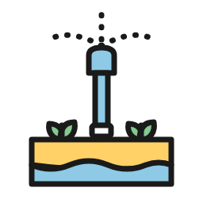
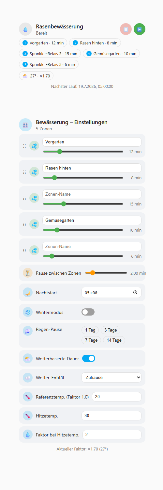
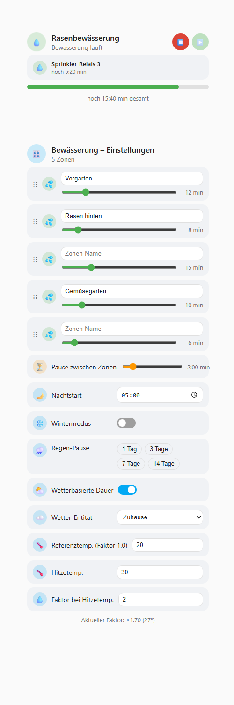
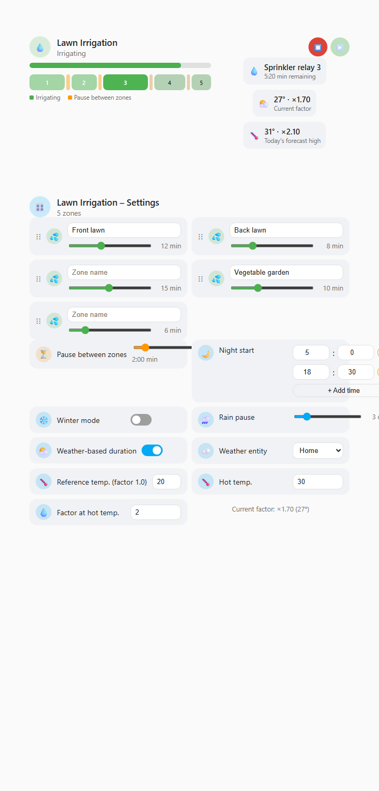

# Irrigation Sequencer

*[English version](README.md)*

Mehrzonen-Bewässerungssteuerung für Home Assistant mit zwei grafischen
Lovelace-Cards im Stil der nativen Home-Assistant-Tile-Cards.

Steuert 1 bis 10 Ventile bzw. Steckdosen nacheinander in einer frei
konfigurierbaren Reihenfolge – jede Zone kann einen eigenen Namen, eine
eigene Position und Dauer haben – inklusive Pausen zwischen den Zonen,
nächtlichem Start, Wintermodus, manueller Regen-Pause und optionaler
wetterbasierter Dauer-Anpassung.




*Beispiel mit 5 Zonen. `screenshots/demo.html` ist eine eigenständige,
interaktive Kopie der echten Cards, die du ohne Home-Assistant-Instanz direkt
im Browser ausprobieren kannst.*

## Funktionen

- **Zwei Cards**: eine reine **Status-Card** (Zeitleiste, aktive Zone,
  Wetter-Faktor, nächster Lauf) und eine **Settings-Card** (alle
  Einstellungen) – so kannst du den Status z. B. auf einem
  Übersichts-Dashboard zeigen und die Einstellungen woanders unterbringen
- **Visuelle Zeitleiste** – alle Zonen und Pausen als ein proportionaler
  Balken, eingefärbt nach fertig/aktiv/kommend – auf einen Blick sichtbar,
  welches Ventil gerade arbeitet, wie lange und wo die Pausen liegen
- **Horizontales oder vertikales Layout** – beide Cards haben eine
  `layout`-Option (auch im visuellen Editor wählbar), um zwischen einer
  hohen, schmalen und einer breiten, kurzen Anordnung zu wechseln – praktisch
  für breite Dashboard-Spalten
- **Eigene Zonen-Namen** – jedes Ventil/jede Steckdose kann einen eigenen
  Anzeigenamen bekommen, unabhängig vom Namen der zugrunde liegenden Entität
- **Sequenz mit fester Reihenfolge** – jede Zone wird nacheinander bewässert,
  die Reihenfolge lässt sich in der Settings-Card per Drag & Drop ändern
- **Individuelle Dauer pro Zone** – jede Zone hat ihre eigene Bewässerungsdauer (Minuten)
- **Pause zwischen den Zonen** – konfigurierbare Wartezeit, bevor die nächste Zone startet
- **1–3 tägliche Startzeiten** – z. B. ein früher und ein später Lauf am Tag, jede startet unabhängig eine vollständige Sequenz. Zeiten, die sich überschneiden würden (näher beieinander als ein Durchlauf dauert), werden mit klarer Meldung abgelehnt – sowohl in der Card als auch bei Nutzung des Service.
- **Wintermodus** – ein Schalter, der die gesamte Bewässerung komplett deaktiviert
- **Regen-Pause** – die Sequenz für 1 bis 24 Tage manuell aussetzen (z. B. nach
  Regen) über einen einzigen Schieberegler, der sie auch wieder ausschaltet
  (auf 0 ziehen); danach läuft der normale Zeitplan automatisch wieder
- **Wetterbasierte Dauer-Anpassung** – optional die Dauer jeder Zone mit einem
  Faktor multiplizieren, der aus der aktuellen Außentemperatur berechnet wird,
  linear interpoliert zwischen zwei Referenzpunkten. Beispiel mit den
  Standardwerten (Faktor 1.0 bei 20 °C, Faktor 2.0 bei 30 °C): bei 25 °C ist
  der Faktor 1.5 – eine 5-minütige Zone läuft dann 7,5 Minuten. Die
  Status-Card zeigt zusätzlich die Tageshöchsttemperatur laut Prognose (sofern
  die Wetter-Entität eine liefert) und den daraus resultierenden Faktor – so
  siehst du schon vorab, wie der nächste Lauf ausfallen würde.
- **Optionale Mobile-Benachrichtigung** – in der Settings-Card ein Gerät
  auswählen (aus deinen `notify.mobile_app_*`-Diensten), um nach jedem
  abgeschlossenen Lauf eine Benachrichtigung mit der Dauer zu erhalten;
  Standard ist "keine" (keine Benachrichtigungen). Der Text folgt der
  Instanzsprache, genau wie die Cards.

## Voraussetzungen

Die Integration steuert vorhandene `switch`- oder `valve`-Entitäten (z. B.
Shelly-Relais, smarte Steckdosen, native HA-Ventile). Sie bringt selbst keine
Hardware-Anbindung mit – lege deine Ventile/Steckdosen vorher wie gewohnt in
Home Assistant an. `light`-Entitäten werden ebenfalls akzeptiert – praktisch
zum Testen mit einer Lampe, wenn gerade kein echtes Ventil zur Hand ist, und
dauerhaft als Option zum Experimentieren erhalten, auch wenn es nicht der
Hauptanwendungsfall ist.

## Installation über HACS

Das ist ein einziger HACS-Eintrag, Kategorie **Integration**. Die Cards
stecken in der Integration und melden sich beim Start automatisch selbst an
– kein separater "Dashboard"-Eintrag, keine manuelle Lovelace-Ressource und
keine `?v=...`-Cache-Busting-Strings mehr, um die man sich kümmern muss.
Ein Update des einen HACS-Eintrags aktualisiert Backend und Cards zusammen.

1. HACS → oben rechts auf die drei Punkte → **Benutzerdefinierte
   Repositories**
2. `https://github.com/ReneSattler/ha-irrigation-sequencer` hinzufügen, Typ
   **Integration** → **Hinzufügen**, dann "Irrigation Sequencer" in der
   HACS-Integrationen-Liste suchen und den Download-Button anklicken
3. Home Assistant neu starten
4. **Einstellungen → Geräte & Dienste → Integration hinzufügen** →
   "Irrigation Sequencer" suchen und einrichten (1 bis 10
   Ventil-/Steckdosen-Entitäten auswählen)
5. Die Cards zu einem Dashboard hinzufügen (siehe "Cards einrichten" unten)
   – sie sind bereits verfügbar, kein weiterer Schritt nötig

## Manuelle Installation

1. Ordner `custom_components/irrigation_sequencer` in dein
   `config/custom_components/`-Verzeichnis kopieren
2. Home Assistant neu starten und die Integration wie oben beschrieben
   einrichten

Die Cards melden sich genauso selbst an wie bei der HACS-Installation – bei
keinem der beiden Installationswege ist ein Kopieren nach `www/` oder eine
manuelle Lovelace-Ressource nötig.

## Cards einrichten

> **Findest du die Cards nicht in der Auswahl?** Das Card-Skript wird nur
> beim vollständigen Laden der Startseite eingebunden - ein Browser-Tab
> (oder die Handy-App), der schon offen war, bevor du die Integration
> installiert/aktualisiert hast, bekommt es nicht mit. Tab bzw. App
> komplett schließen und neu öffnen (ein einfaches Neuladen reicht nicht
> immer), dann erneut versuchen, die Karte hinzuzufügen.

Nach der Einrichtung der Integration zwei neue Lovelace-Karten hinzufügen und
`Irrigation Sequencer - Status` bzw. `Irrigation Sequencer - Settings`
auswählen. Im visuellen Editor jeweils die Status-Sensor-Entität
(`sensor.<name>_status`) auswählen. Die Texte folgen automatisch der
Home-Assistant-UI-Sprache (Fallback: Englisch).

```yaml
type: custom:irrigation-sequencer-status-card
entity: sensor.rasenbewasserung_status
title: Rasenbewässerung
```

```yaml
type: custom:irrigation-sequencer-settings-card
entity: sensor.rasenbewasserung_status
title: Rasenbewässerung – Einstellungen
```

Mit `layout: horizontal` in der Konfiguration einer Card (oder Auswahl im
visuellen Editor) gibt es eine breitere, kürzere Anordnung – praktisch für
eine breite Dashboard-Spalte oder Grid-Sektion:



## Konfiguration später ändern

Nur die *anfängliche* Zonen-Auswahl ist ein klassischer "Einrichtungsdialog"
– alles andere ist eine Live-Einstellung, kein einmaliger Konfigurationsschritt:

- **Zonen (Ventile hinzufügen/entfernen)**: unter **Einstellungen → Geräte &
  Dienste → Irrigation Sequencer → Konfigurieren** öffnet sich ein
  Optionen-Dialog, in dem du die 1–10 Ventil-/Steckdosen-Entitäten jederzeit
  neu auswählen kannst. Zonen, die ausgewählt bleiben, behalten ihren Namen,
  ihre Dauer und Position; neu hinzugefügte Zonen bekommen Standardwerte.
- **Zonen-Namen, -Reihenfolge, -Dauer, Wintermodus, Regen-Pause, Nachtstart,
  Pause zwischen Zonen, Wetter-Anpassung**: das sind keine
  Dialog-Einstellungen, sondern Live-Werte, die du direkt über die
  Settings-Card änderst (empfohlen), über die bereitgestellten Entitäten
  `switch.*_winter_mode` / `switch.*_weather_adjustment`, oder über die
  Services unten (praktisch für eigene Automationen, z. B. "Wintermodus jedes
  Jahr am 1. November aktivieren").

## Dienste (Services)

Alle Einstellungen lassen sich auch per Service-Aufruf ändern, z. B. für
eigene Automationen:

| Service | Beschreibung |
|---|---|
| `irrigation_sequencer.start_now` | Sequenz sofort manuell starten |
| `irrigation_sequencer.stop` | Laufende Sequenz sofort abbrechen |
| `irrigation_sequencer.set_zone_order` | Reihenfolge der Zonen festlegen |
| `irrigation_sequencer.set_zone_name` | Eigenen Anzeigenamen für eine Zone setzen |
| `irrigation_sequencer.set_zone_duration` | Bewässerungsdauer einer Zone setzen |
| `irrigation_sequencer.set_pause_between_zones` | Pause zwischen Zonen setzen |
| `irrigation_sequencer.set_start_times` | Tägliche Startzeiten setzen (1–3) |
| `irrigation_sequencer.set_rain_pause` | Regen-Pause für 1–24 Tage setzen |
| `irrigation_sequencer.clear_rain_pause` | Regen-Pause sofort aufheben |
| `irrigation_sequencer.set_winter_mode` | Wintermodus aktivieren/deaktivieren |
| `irrigation_sequencer.set_weather_adjustment` | Temperaturabhängige Dauer-Anpassung konfigurieren |
| `irrigation_sequencer.set_notify_target` | Benachrichtigungsziel nach Abschluss setzen (oder entfernen) |

Die `entry_id` findest du als Attribut am Status-Sensor der Integration.

## Entwicklung

Für die Backend-Logik (`custom_components/irrigation_sequencer/manager.py`)
gibt es eine pytest-Testsuite mit
[pytest-homeassistant-custom-component](https://github.com/MatthewFlamm/pytest-homeassistant-custom-component):

```bash
pip install -r requirements-test.txt
pytest tests/ -v
```

Läuft automatisch bei jedem Push/PR über GitHub Actions
(`.github/workflows/tests.yml`).

> **Hinweis für Windows**: `pytest-homeassistant-custom-component` kann
> lokal unter Windows mit einem `pytest_socket.SocketBlockedError` beim
> Testaufbau fehlschlagen - Pythons `ProactorEventLoop` benötigt für seine
> interne Selbstverbindung ein echtes OS-Socket, das vom
> Socket-Sicherheitsnetz der Testsuite blockiert wird. CI (Linux) ist davon
> nicht betroffen. Für lokale Tests unter Windows entweder WSL nutzen oder
> die Selector-Event-Loop-Policy erzwingen
> (`asyncio.set_event_loop_policy(asyncio.WindowsSelectorEventLoopPolicy())`)
> - `tests/conftest.py` macht das bereits, hat das Problem bisher aber nicht
> in jeder getesteten Umgebung vollständig gelöst.

## Lizenz

MIT – siehe [LICENSE](LICENSE)
