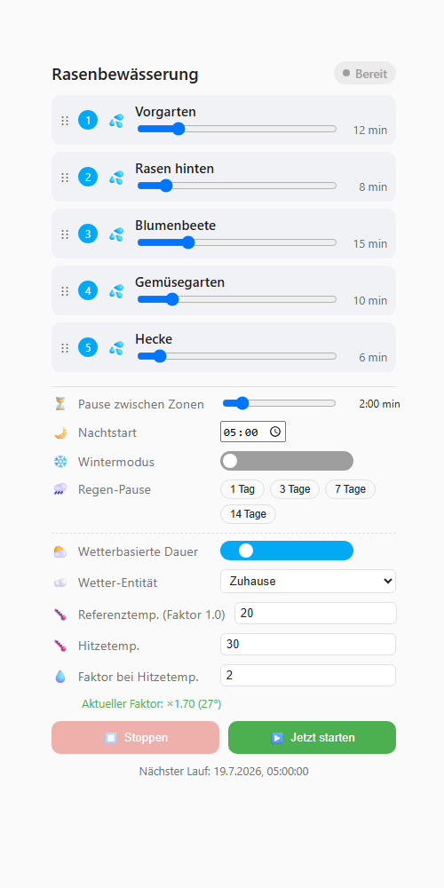
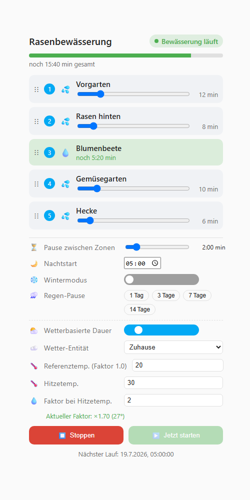

# Irrigation Sequencer

*[English version](README.md)*

Mehrzonen-Bewässerungssteuerung für Home Assistant mit grafischer Lovelace-Card.

Steuert 2 bis 10 Ventile bzw. Steckdosen nacheinander in einer frei
konfigurierbaren Reihenfolge – inklusive Pausen zwischen den Zonen,
nächtlichem Start, Wintermodus, manueller Regen-Pause und optionaler
wetterbasierter Dauer-Anpassung.




*Beispiel mit 5 Zonen. `screenshots/demo.html` ist eine eigenständige,
interaktive Kopie der echten Card, die du ohne Home-Assistant-Instanz direkt
im Browser ausprobieren kannst.*

## Funktionen

- **Sequenz mit fester Reihenfolge** – jede Zone wird nacheinander bewässert,
  die Reihenfolge lässt sich in der Card per Drag & Drop ändern
- **Individuelle Dauer pro Zone** – jede Zone hat ihre eigene Bewässerungsdauer (Minuten)
- **Pause zwischen den Zonen** – konfigurierbare Wartezeit, bevor die nächste Zone startet
- **Nachtstart** – tägliche automatische Startzeit (z. B. 05:00 Uhr)
- **Wintermodus** – ein Schalter, der die gesamte Bewässerung komplett deaktiviert
- **Regen-Pause** – die Sequenz für 1 bis 14 Tage manuell aussetzen (z. B. nach Regen),
  danach läuft der normale Zeitplan automatisch wieder
- **Wetterbasierte Dauer-Anpassung** – optional die Dauer jeder Zone mit einem
  Faktor multiplizieren, der aus der aktuellen Außentemperatur berechnet wird
  (z. B. Faktor 1.0 bei 20 °C, Faktor 2.0 bei 30 °C, dazwischen linear interpoliert)
- **Grafische Lovelace-Card** – Zonen als Karten mit Live-Animation der aktiv
  bewässernden Zone, Fortschrittsbalken, Slidern für Dauer/Pause und
  Schnellauswahl-Buttons für die Regen-Pause

## Voraussetzungen

Die Integration steuert vorhandene `switch`- oder `valve`-Entitäten (z. B.
Shelly-Relais, smarte Steckdosen, native HA-Ventile). Sie bringt selbst keine
Hardware-Anbindung mit – lege deine Ventile/Steckdosen vorher wie gewohnt in
Home Assistant an.

## Installation über HACS

1. HACS öffnen → **Integrationen** (bzw. **Frontend** für die Card) → oben
   rechts auf die drei Punkte → **Benutzerdefinierte Repositories**
2. Repository-URL hinzufügen: `https://github.com/ReneSattler/ha-irrigation-sequencer`
   - Kategorie **Integration** hinzufügen → installiert die Backend-Logik
   - Kategorie **Plugin (Frontend)** hinzufügen → installiert die Lovelace-Card
3. Home Assistant neu starten
4. **Einstellungen → Geräte & Dienste → Integration hinzufügen** →
   "Irrigation Sequencer" suchen
5. Im Einrichtungsdialog 2 bis 10 Ventil-/Steckdosen-Entitäten auswählen

## Manuelle Installation

1. Ordner `custom_components/irrigation_sequencer` in dein `config/custom_components/`
   Verzeichnis kopieren
2. Datei `irrigation-sequencer-card/irrigation-sequencer-card.js` nach
   `config/www/` kopieren
3. Unter **Einstellungen → Dashboards → Ressourcen** die Datei
   `/local/irrigation-sequencer-card.js` als JavaScript-Modul hinzufügen
4. Home Assistant neu starten und die Integration wie oben beschrieben einrichten

## Card einrichten

Nach der Einrichtung der Integration eine neue Lovelace-Karte hinzufügen und
`Irrigation Sequencer Card` auswählen. Im visuellen Editor die
Status-Sensor-Entität (`sensor.<name>_status`) auswählen – alle weiteren
Einstellungen (Reihenfolge, Dauer, Pausen, Startzeit, Wintermodus,
Regen-Pause, Wetter-Anpassung) werden direkt über die Karte gesteuert. Die
Texte der Card folgen automatisch der Home-Assistant-UI-Sprache (Fallback:
Englisch).

```yaml
type: custom:irrigation-sequencer-card
entity: sensor.rasenbewasserung_status
title: Rasenbewässerung
```

## Konfiguration später ändern

Nur die *anfängliche* Zonen-Auswahl ist ein klassischer "Einrichtungsdialog"
– alles andere ist eine Live-Einstellung, kein einmaliger Konfigurationsschritt:

- **Zonen (Ventile hinzufügen/entfernen)**: unter **Einstellungen → Geräte &
  Dienste → Irrigation Sequencer → Konfigurieren** öffnet sich ein
  Optionen-Dialog, in dem du die 2–10 Ventil-/Steckdosen-Entitäten jederzeit
  neu auswählen kannst. Zonen, die ausgewählt bleiben, behalten ihre Dauer und
  Position; neu hinzugefügte Zonen bekommen Standardwerte.
- **Wintermodus, Regen-Pause, Nachtstart, Pause zwischen Zonen,
  Wetter-Anpassung, Zonen-Reihenfolge und -Dauer**: das sind keine
  Dialog-Einstellungen, sondern Live-Entitäten/-Werte, die du direkt über die
  Card änderst (empfohlen), über die bereitgestellten Entitäten
  `switch.*_winter_mode` / `switch.*_weather_adjustment`, oder über die
  Services unten (praktisch für eigene Automationen, z. B. "Wintermodus jedes
  Jahr am 1. November aktivieren").

## Dienste (Services)

Alle Einstellungen lassen sich auch per Service-Aufruf ändern, z. B. für
eigene Automationen:

| Service | Beschreibung |
|---|---|
| `irrigation_sequencer.start_now` | Sequenz sofort manuell starten |
| `irrigation_sequencer.stop` | Laufende Sequenz sofort abbrechen |
| `irrigation_sequencer.set_zone_order` | Reihenfolge der Zonen festlegen |
| `irrigation_sequencer.set_zone_duration` | Bewässerungsdauer einer Zone setzen |
| `irrigation_sequencer.set_pause_between_zones` | Pause zwischen Zonen setzen |
| `irrigation_sequencer.set_start_time` | Tägliche Startzeit setzen |
| `irrigation_sequencer.set_rain_pause` | Regen-Pause für 1–14 Tage setzen |
| `irrigation_sequencer.clear_rain_pause` | Regen-Pause sofort aufheben |
| `irrigation_sequencer.set_weather_adjustment` | Temperaturabhängige Dauer-Anpassung konfigurieren |

Die `entry_id` findest du als Attribut am Status-Sensor der Integration.

## Lizenz

MIT – siehe [LICENSE](LICENSE)
