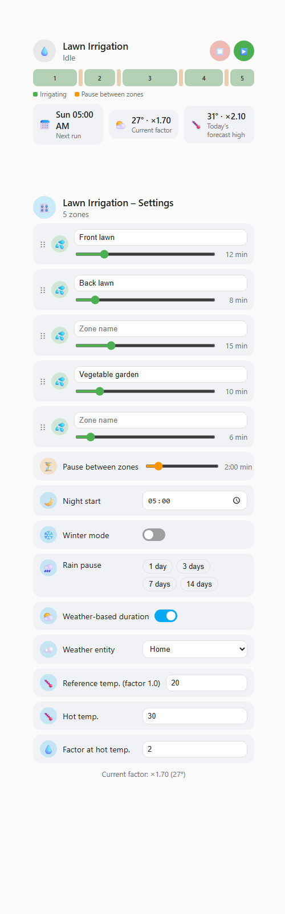
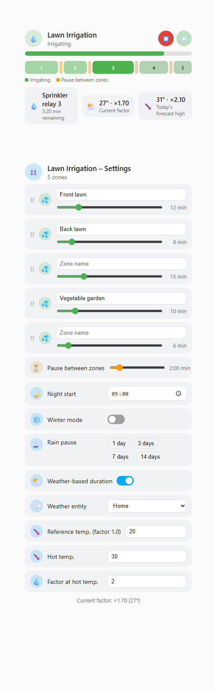

# Irrigation Sequencer

*[Deutsche Version](README.de.md)*

Multi-zone irrigation control for Home Assistant with two graphical Lovelace
cards, styled after Home Assistant's native Tile cards.

Controls 1 to 10 valves or smart plugs in a freely configurable sequence -
each zone can have its own custom name, order and duration - including
pauses between zones, a nightly start time, a winter mode, a manual rain
pause, and an optional weather-based duration adjustment.




*Example with 5 zones. `screenshots/demo.html` is a standalone, interactive
copy of the real cards you can open in any browser to try them out without a
Home Assistant instance.*

## Features

- **Two cards**: a read-only **status card** (schedule timeline, active
  zone, weather factor, next run) and a **settings card** (everything
  configurable), so you can place the status on an overview dashboard and
  keep the settings elsewhere
- **Visual schedule timeline** - all zones and pauses shown as one
  proportional bar, colored by done/active/upcoming, so you can see at a
  glance which valve is running, for how long, and where the pauses are
- **Horizontal or vertical layout** - both cards have a `layout` option
  (also selectable in the visual editor) to switch between a tall, narrow
  arrangement and a wide, short one for wide dashboard columns
- **Custom zone names** - give each valve/plug its own display name,
  independent of the underlying entity name
- **Sequential order** - each zone is irrigated one after another; the order
  can be changed by drag & drop directly in the settings card
- **Per-zone duration** - every zone has its own irrigation duration (minutes)
- **Pause between zones** - configurable wait time before the next zone starts
- **1-3 daily start times** - e.g. an early-morning and a late-evening run, each independently triggering a full sequence. Times that would overlap (closer together than a full run takes) are rejected with a clear message, both in the card and if set via the service.
- **Winter mode** - a single switch that fully disables irrigation
- **Rain pause** - manually pause the sequence for 1 to 24 days (e.g. after
  rainfall) via a single slider that also turns it off again (drag to 0); the
  normal schedule resumes automatically once the pause expires
- **Weather-based duration adjustment** - optionally scale every zone's
  duration by a factor derived from the current outside temperature, linearly
  interpolated between two reference points. Example with the defaults
  (factor 1.0 at 20 °C, factor 2.0 at 30 °C): at 25 °C the factor is 1.5, so a
  5-minute zone runs for 7.5 minutes. The status card also shows today's
  forecast high (when the weather entity provides one) and the factor it
  would result in, so you can see tomorrow's plan at a glance.

## Requirements

The integration controls existing `switch` or `valve` entities (e.g. Shelly
relays, smart plugs, native HA valves). It does not provide any hardware
integration itself - set up your valves/plugs in Home Assistant as usual
first. `light` entities are also accepted - handy for testing with a lamp
when you don't have a real valve on hand, and kept as a permanent option
for experimenting even though it isn't the primary use case.

## Installation via HACS

1. Open HACS → **Integrations** (or **Frontend** for the cards) → three-dot
   menu in the top right → **Custom repositories**
2. Add the repository URL: `https://github.com/ReneSattler/ha-irrigation-sequencer`
   - Add category **Integration** → installs the backend logic
   - Add category **Plugin (Frontend)** → installs the Lovelace cards
3. Restart Home Assistant
4. **Settings → Devices & Services → Add Integration** → search for
   "Irrigation Sequencer"
5. In the setup dialog, select 1 to 10 valve/plug entities

## Manual installation

1. Copy the `custom_components/irrigation_sequencer` folder into your
   `config/custom_components/` directory
2. Copy `irrigation-sequencer-card/irrigation-sequencer-card.js` into
   `config/www/`
3. Under **Settings → Dashboards → Resources**, add
   `/local/irrigation-sequencer-card.js?v=0.9.4` as a JavaScript module (the
   `?v=...` part matters - see note below)
4. Restart Home Assistant and set up the integration as described above

> **Updating a manual install**: browsers (especially on mobile) can cache
> the plain `.js` resource indefinitely, silently serving an old version
> after you copy in an update - with no visible sign anything is stale.
> Bump the `?v=...` query string in the resource URL (Settings → Dashboards
> → Resources → edit) to match the new version every time you update the
> file manually, so browsers are forced to fetch the new copy. You can
> double check which version actually loaded by opening the browser
> console (F12) - the card logs its version on load. HACS installs handle
> this automatically and don't need this step.

## Setting up the cards

After setting up the integration, add two new Lovelace cards and choose
`Irrigation Sequencer - Status` and `Irrigation Sequencer - Settings`. In the
visual editor of each, select the status sensor entity
(`sensor.<name>_status`). Card text automatically follows the Home Assistant
UI language (falls back to English).

```yaml
type: custom:irrigation-sequencer-status-card
entity: sensor.lawn_irrigation_status
title: Lawn irrigation
```

```yaml
type: custom:irrigation-sequencer-settings-card
entity: sensor.lawn_irrigation_status
title: Lawn irrigation settings
```

Add `layout: horizontal` to either card's config (or pick it in the visual
editor) for a wider, shorter arrangement - handy in a wide dashboard column
or grid section:


## Changing the configuration later

Only the *initial* zone selection is a classic "setup dialog" - everything
else is a live setting, not a one-time config step:

- **Zones (add/remove valves)**: go to **Settings → Devices & Services →
  Irrigation Sequencer → Configure**. This opens an options dialog where you
  can re-select the 1-10 valve/plug entities at any time. Zones that stay
  selected keep their configured name, duration and position; newly added
  zones get default values.
- **Zone names, order, durations, winter mode, rain pause, night start, pause
  between zones, weather adjustment**: these are not part of a config dialog
  at all - they are live settings you change directly through the settings
  card (recommended), through the exposed `switch.*_winter_mode` /
  `switch.*_weather_adjustment` entities, or via the services below (handy
  for your own automations, e.g. "turn on winter mode every November 1st").

## Services

Every setting can also be changed via a service call, e.g. from your own
automations:

| Service | Description |
|---|---|
| `irrigation_sequencer.start_now` | Start the sequence immediately |
| `irrigation_sequencer.stop` | Abort a running sequence immediately |
| `irrigation_sequencer.set_zone_order` | Set the irrigation order of the zones |
| `irrigation_sequencer.set_zone_name` | Set a custom display name for a zone |
| `irrigation_sequencer.set_zone_duration` | Set the irrigation duration of a zone |
| `irrigation_sequencer.set_pause_between_zones` | Set the pause between zones |
| `irrigation_sequencer.set_start_times` | Set the daily start times (1-3) |
| `irrigation_sequencer.set_rain_pause` | Pause irrigation for 1-24 days |
| `irrigation_sequencer.clear_rain_pause` | Clear an active rain pause |
| `irrigation_sequencer.set_winter_mode` | Enable or disable winter mode |
| `irrigation_sequencer.set_weather_adjustment` | Configure temperature-based duration adjustment |

You can find the `entry_id` as an attribute on the integration's status
sensor.

## Development

Backend logic (`custom_components/irrigation_sequencer/manager.py`) has a
pytest test suite using
[pytest-homeassistant-custom-component](https://github.com/MatthewFlamm/pytest-homeassistant-custom-component):

```bash
pip install -r requirements-test.txt
pytest tests/ -v
```

Runs automatically on every push/PR via GitHub Actions
(`.github/workflows/tests.yml`).

> **Windows note**: `pytest-homeassistant-custom-component` can fail locally
> on Windows with a `pytest_socket.SocketBlockedError` during test setup -
> asyncio's default `ProactorEventLoop` needs a real OS socket for its
> internal self-pipe, which the test suite's socket-blocking safety net
> rejects. CI (Linux) isn't affected. If you need to run tests locally on
> Windows, use WSL, or try forcing the selector event loop policy
> (`asyncio.set_event_loop_policy(asyncio.WindowsSelectorEventLoopPolicy())`)
> before pytest starts - this repo's `tests/conftest.py` already does this,
> though it hasn't fully resolved it in every environment tested so far.

## License

MIT - see [LICENSE](LICENSE)
