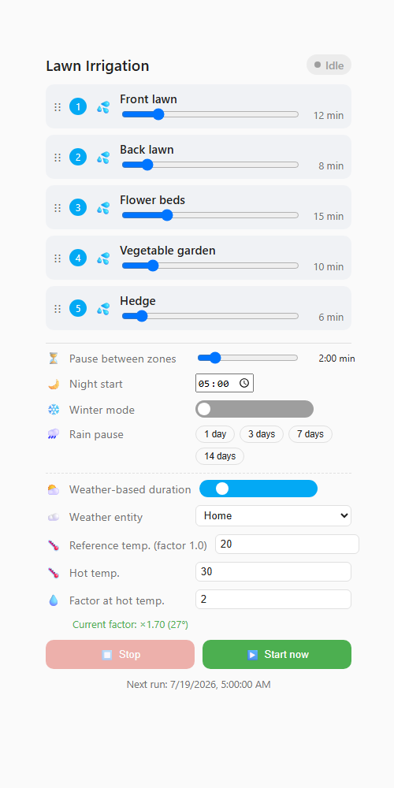
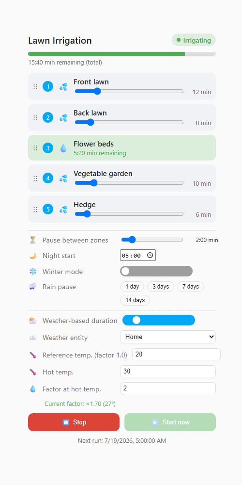

# Irrigation Sequencer

*[Deutsche Version](README.de.md)*

Multi-zone irrigation control for Home Assistant with a graphical Lovelace card.

Controls 2 to 10 valves or smart plugs in a freely configurable sequence -
including pauses between zones, a nightly start time, a winter mode, a manual
rain pause, and an optional weather-based duration adjustment.




*Example with 5 zones. `screenshots/demo.html` is a standalone, interactive
copy of the real card you can open in any browser to try it out without a
Home Assistant instance.*

## Features

- **Sequential order** - each zone is irrigated one after another; the order
  can be changed by drag & drop directly in the card
- **Per-zone duration** - every zone has its own irrigation duration (minutes)
- **Pause between zones** - configurable wait time before the next zone starts
- **Night start** - daily automatic start time (e.g. 05:00)
- **Winter mode** - a single switch that fully disables irrigation
- **Rain pause** - manually pause the sequence for 1 to 14 days (e.g. after
  rainfall); the normal schedule resumes automatically afterwards
- **Weather-based duration adjustment** - optionally scale every zone's
  duration by a factor derived from the current outside temperature (e.g.
  factor 1.0 at 20 °C, factor 2.0 at 30 °C, linearly interpolated in between)
- **Graphical Lovelace card** - zones shown as cards with a live animation of
  the currently active zone, a progress bar, sliders for duration/pause and
  quick-select buttons for the rain pause

## Requirements

The integration controls existing `switch` or `valve` entities (e.g. Shelly
relays, smart plugs, native HA valves). It does not provide any hardware
integration itself - set up your valves/plugs in Home Assistant as usual
first.

## Installation via HACS

1. Open HACS → **Integrations** (or **Frontend** for the card) → three-dot
   menu in the top right → **Custom repositories**
2. Add the repository URL: `https://github.com/ReneSattler/ha-irrigation-sequencer`
   - Add category **Integration** → installs the backend logic
   - Add category **Plugin (Frontend)** → installs the Lovelace card
3. Restart Home Assistant
4. **Settings → Devices & Services → Add Integration** → search for
   "Irrigation Sequencer"
5. In the setup dialog, select 2 to 10 valve/plug entities

## Manual installation

1. Copy the `custom_components/irrigation_sequencer` folder into your
   `config/custom_components/` directory
2. Copy `irrigation-sequencer-card/irrigation-sequencer-card.js` into
   `config/www/`
3. Under **Settings → Dashboards → Resources**, add
   `/local/irrigation-sequencer-card.js` as a JavaScript module
4. Restart Home Assistant and set up the integration as described above

## Setting up the card

After setting up the integration, add a new Lovelace card and choose
`Irrigation Sequencer Card`. In the visual editor, select the status sensor
entity (`sensor.<name>_status`) - every other setting (order, duration,
pauses, start time, winter mode, rain pause, weather adjustment) is
controlled directly through the card. The card's UI text automatically
follows the Home Assistant UI language (falls back to English).

```yaml
type: custom:irrigation-sequencer-card
entity: sensor.lawn_irrigation_status
title: Lawn irrigation
```

## Changing the configuration later

Only the *initial* zone selection is a classic "setup dialog" - everything
else is a live setting, not a one-time config step:

- **Zones (add/remove valves)**: go to **Settings → Devices & Services →
  Irrigation Sequencer → Configure**. This opens an options dialog where you
  can re-select the 2-10 valve/plug entities at any time. Zones that stay
  selected keep their configured duration and position; newly added zones
  get default values.
- **Winter mode, rain pause, night start, pause between zones, weather
  adjustment, zone order and durations**: these are not part of a config
  dialog at all - they are live entities/settings you change directly through
  the card (recommended), through the exposed `switch.*_winter_mode` /
  `switch.*_weather_adjustment` entities, or via the services below (handy
  for your own automations, e.g. "turn on winter mode every November 1st").

## Services

Every setting can also be changed via a service call, e.g. from your own
automations:

| Service | Description |
|---|---|
| `irrigation_sequencer.start_now` | Start the sequence immediately |
| `irrigation_sequencer.stop` | Abort a running sequence immediately |
| `irrigation_sequencer.set_zone_order` | Set the irrigation order of the zones |
| `irrigation_sequencer.set_zone_duration` | Set the irrigation duration of a zone |
| `irrigation_sequencer.set_pause_between_zones` | Set the pause between zones |
| `irrigation_sequencer.set_start_time` | Set the daily start time |
| `irrigation_sequencer.set_rain_pause` | Pause irrigation for 1-14 days |
| `irrigation_sequencer.clear_rain_pause` | Clear an active rain pause |
| `irrigation_sequencer.set_weather_adjustment` | Configure temperature-based duration adjustment |

You can find the `entry_id` as an attribute on the integration's status
sensor.

## License

MIT - see [LICENSE](LICENSE)
